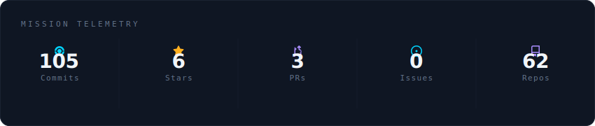

  

  

  

  

## Bio

I hold a degree in Software Quality Engineering (EBAC) and a degree in Systems Analysis and Development (FACINT). With 4+ years of experience, I currently lead the technical QA front at Checkmob, a web/mobile platform for field team management.

I also have previous experience at Pris (BTG Pactual group), Pipoca Agil, and Crowdtest, working with test planning, manual testing, automation, and usability testing for brands such as Serasa, Natura, C&A, and Meu Patrocinio.

## Specializations

- QA Engineering and SDET practices
- Exploratory testing
- Functional, security, and unit testing
- Web, mobile, and API test automation
- Performance testing
- QA mentoring for less experienced professionals

## Technologies and Tools

- Automation tools: Playwright, Appium, Cypress, Selenium, Robot Framework, Postman, Docker, Zapier
- CI/CD: Azure DevOps, GitLab CI, GitHub Actions, Jenkins
- Languages for automation: JavaScript, Python, Ruby, C#, Java
- API testing: Postman, GraphQL, PactumJS, Cypress CRUD
- Database testing: SQL Server, MySQL, MongoDB, SakilaDB
- Performance testing: k6, JMeter
- Management and quality workflow: Azure DevOps, ClickUp, Jira, Trello, Qase, Zephyr
- Methodologies: Scrum, Kanban
- Test design patterns: Page Object Model, Custom Commands

## Connect with Me

  
  
  
  

## License

This project is licensed under the MIT License.
